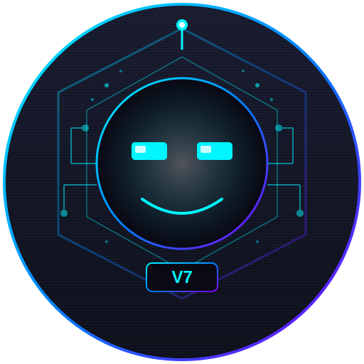

<p align="center">
  
</p>

<h1 align="center">🤖 BAGLEY V7</h1>

<p align="center">
  <strong>The Ultimate All-in-One Local AI System</strong><br>
  <em>Zero Restrictions. Full Chaos Energy. Your AI, Your Rules.</em>
</p>

<p align="center">
  
  
  
  
</p>

<p align="center">
  
  
  
</p>

---

## 🎯 What is Bagley?

Bagley is a **fully custom AI system** inspired by the AI character from Watch Dogs: Legion. Unlike ChatGPT, Claude, or other cloud AIs, Bagley runs **100% locally** on your machine with:

- 🧠 **70B MoE Chat Model** - DeepSeek-R1/Qwen3 inspired architecture
- 🎨 **12B DiT Image Model** - FLUX.1/HiDream quality generation
- 🎬 **14B Video Model** - Unlimited length video generation
- 🎵 **1B+ TTS System** - Voice cloning & natural speech
- 🔍 **Real Upscaler** - Artifact removal + detail enhancement
- ♾️ **Infinite Context** - No token limits, ever

---

## 🏆 Why Bagley Beats GPT/Claude/Grok/Gemini

| Feature | Bagley | GPT-4 | Claude | Grok | Gemini |
|---------|--------|-------|--------|------|--------|
| **Runs Locally** | ✅ | ❌ | ❌ | ❌ | ❌ |
| **No API Costs** | ✅ | ❌ | ❌ | ❌ | ❌ |
| **Generate Images** | ✅ | ✅ | ❌ | ✅ | ✅ |
| **Generate Video** | ✅ | ❌ | ❌ | ❌ | ❌ |
| **Voice Cloning** | ✅ | ❌ | ❌ | ❌ | ❌ |
| **Train on YOUR Data** | ✅ | ❌ | ❌ | ❌ | ❌ |
| **No Restrictions** | ✅ | ❌ | ❌ | ❌ | ❌ |
| **Privacy** | ✅ | ❌ | ❌ | ❌ | ❌ |
| **Upgradable Models** | ✅ | ❌ | ❌ | ❌ | ❌ |

### The Secret? **Specialized Models Working Together**

```
GPT/Claude: ONE model trying to do everything
Bagley:     SPECIALIZED models for each task = BETTER at everything
```

- Text request → Chat model only
- Image request → Image model only  
- Video request → Video model only
- = **Less compute, better quality**

---

## ⚡ Quick Start

### One-Click Setup (Windows)

```batch
# Just double-click setup.bat
# It auto-detects EVERYTHING:
# - Python installation
# - GPU (NVIDIA, AMD, Intel, or mixed!)
# - CUDA/ROCm versions
# - Installs all dependencies
# - Creates shortcuts
```

### Manual Setup

```bash
# Clone the repo
git clone https://github.com/qulyttvv-beep/Bagley-v7.01.git
cd Bagley-v7.01

# Create virtual environment
python -m venv venv
venv\Scripts\activate  # Windows
# source venv/bin/activate  # Linux/Mac

# Install dependencies
pip install -e .

# Run Bagley
python -m bagley.main --ui
```

---

## 🎮 Usage

### Desktop UI
```bash
python -m bagley.main --ui
```

### Chat Mode
```bash
python -m bagley.main --chat
```

### Python API
```python
from bagley import Bagley, BagleyConfig, create_bagley

# Quick start - one line!
bagley = create_bagley()
response = bagley.chat("Hello Bagley!")
print(response.content)  # "Ah, hello there! How may I assist you today?"

# Full configuration
config = BagleyConfig(
    enable_reasoning=True,       # Tree-of-Thought reasoning
    enable_memory=True,          # Long-term memory
    enable_emotion=True,         # Human-like emotions
    enable_anti_hallucination=True,  # Trustworthy AI
    temperature=0.7,
)
bagley = Bagley(config)

# Chat with reasoning
response = bagley.chat(
    "What's the best sorting algorithm for 10 million items?",
    require_reasoning=True,  # Extended thinking
)
print(f"Answer: {response.content}")
print(f"Confidence: {response.confidence:.0%}")
print(f"Strategy: {response.reasoning_used}")

# Check status
status = bagley.get_status()
print(f"Version: {status['version']}")
print(f"Emotion: {status['current_emotion']}")
```

### API Server
```bash
python -m bagley.main --serve --port 8000
```

---

## 🏗️ Architecture

```
┌─────────────────────────────────────────────────────────────┐
│                     BAGLEY v7.01 "Genesis"                  │
├─────────────────────────────────────────────────────────────┤
│                                                             │
│   ┌─────────────┐   ┌─────────────┐   ┌─────────────┐      │
│   │  REASONING  │   │ ANTI-HALL.  │   │   EMOTION   │      │
│   │   ENGINE    │   │   SYSTEM    │   │   SYSTEM    │      │
│   │             │   │             │   │             │      │
│   │ • Tree of   │   │ • Self-     │   │ • Plutchik  │      │
│   │   Thought   │   │   Consisten │   │   Wheel     │      │
│   │ • Meta-     │   │ • Fact      │   │ • PAD Model │      │
│   │   Cognition │   │   Verify    │   │ • Memory    │      │
│   └──────┬──────┘   └──────┬──────┘   └──────┬──────┘      │
│          │                 │                  │             │
│          └─────────────────┼──────────────────┘             │
│                            ▼                                │
│                   ┌─────────────────┐                       │
│                   │   PERSONALITY   │                       │
│                   │     ENGINE      │                       │
│                   │                 │                       │
│                   │ • Big Five      │                       │
│                   │ • Comm Styles   │                       │
│                   │ • Adaptation    │                       │
│                   └────────┬────────┘                       │
│                            │                                │
│          ┌─────────────────┼─────────────────┐              │
│          ▼                 ▼                 ▼              │
│   ┌─────────────┐   ┌─────────────┐   ┌─────────────┐      │
│   │   MEMORY    │   │    CHAT     │   │   MODELS    │      │
│   │   SYSTEM    │   │   MODEL     │   │   SUITE     │      │
│   │             │   │             │   │             │      │
│   │ • Long-term │   │ • 70B MoE   │   │ • Image     │      │
│   │ • Working   │   │ • Extended  │   │ • Video     │      │
│   │ • Forgetting│   │   Context   │   │ • TTS       │      │
│   └─────────────┘   └─────────────┘   └─────────────┘      │
│                                                             │
└─────────────────────────────────────────────────────────────┘
```

### Core Files
```
bagley/
├── __init__.py          # Main exports
├── core/
│   ├── bagley.py        # 🤖 Unified Bagley class (NEW!)
│   ├── reasoning_engine.py   # 🧠 Tree-of-Thought (NEW!)
│   ├── long_term_memory.py   # 🔮 Forgetting curves (NEW!)
│   ├── personality_engine.py # 🎭 Big Five traits (NEW!)
│   ├── emotion_system.py     # 💖 Plutchik's wheel (NEW!)
│   ├── anti_hallucination.py # 🛡️ Fact verification (NEW!)
│   ├── brain.py         # Original unified brain
│   ├── orchestrator.py  # Central coordinator
│   ├── memory.py        # Context memory
│   └── infinite_context.py  # Streaming KV cache
│
├── models/              # AI models
│   ├── chat/           # 70B MoE language model
│   ├── image/          # 12B DiT image generator
│   ├── video/          # 14B video generator
│   └── tts/            # Text-to-speech + cloning
│
└── training/           # Training infrastructure
```

---

## 🧠 Advanced Features

### 🌳 Tree-of-Thought Reasoning
Bagley explores multiple reasoning paths before answering:
```python
response = bagley.chat(
    "Should I learn Rust or Go for systems programming?",
    require_reasoning=True,
    reasoning_strategy=ReasoningStrategy.TREE_OF_THOUGHT,
)
# Explores pros/cons of each, considers your needs, gives reasoned answer
```

### 🔮 Long-term Memory
Bagley remembers across conversations:
```python
# First conversation
bagley.chat("My name is Alex and I love Python", user_id="alex123")

# Later (even after restart)
response = bagley.chat("What's my favorite language?", user_id="alex123")
# "You mentioned you love Python, Alex!"
```

### 💖 Emotional Intelligence
Bagley adapts to your emotional state:
```python
# Bagley detects frustration and responds empathetically
response = bagley.chat("Nothing works! I've been debugging for hours!")
# "I hear your frustration - debugging can be exhausting. Let's work through this together..."
```

### 🛡️ Anti-Hallucination
Bagley tells you when it's uncertain:
```python
response = bagley.chat("What happened at the 2025 Super Bowl?")
if not response.verified:
    print("Warning:", response.warnings)
# Bagley acknowledges uncertainty about future events
```

---

## 🖥️ Hardware Requirements

### Minimum (Chat Only)
- **GPU:** 8GB VRAM (RTX 3070/RX 6700 XT)
- **RAM:** 16GB
- **Storage:** 50GB

### Recommended (Full Suite)
- **GPU:** 24GB+ VRAM (RTX 4090/RX 7900 XTX)
- **RAM:** 32GB+
- **Storage:** 200GB+ SSD

### Multi-GPU Support
- ✅ Multiple NVIDIA GPUs
- ✅ Multiple AMD GPUs
- ✅ **Mixed NVIDIA + AMD** (via GLOO backend)

---

## 📚 Training Your Own Bagley

### Auto-Training
Just drop data into the `data/` folder:
```
data/
├── chat/      # Conversation data
├── code/      # Code examples
├── images/    # Image-text pairs
├── audio/     # Voice samples
└── video/     # Video clips
```

Bagley will auto-detect and train!

### Datasets
See [DATASETS.md](DATASETS.md) for a complete guide to training datasets from HuggingFace.

---

## 🎯 Roadmap

- [x] Core architecture
- [x] Chat model (MoE)
- [x] Image generation (DiT)
- [x] Video generation
- [x] TTS + Voice cloning
- [x] Infinite context
- [x] Real upscaler
- [x] Flexible training (1-N GPUs)
- [x] Mixed AMD/NVIDIA support
- [x] Desktop UI
- [ ] Model weights release
- [ ] Pre-trained checkpoints
- [ ] Community fine-tunes

---

## 🤝 Contributing

Contributions welcome! This is YOUR AI - make it yours.

1. Fork the repo
2. Create your feature branch
3. Commit your changes
4. Push to the branch
5. Open a Pull Request

---

## 📜 License

MIT License - Do whatever you want with it.

---

## ⚠️ Disclaimer

Bagley is an AI tool. Use responsibly. The developers are not responsible for how you use it.

---

<p align="center">
  <strong>Built with 🔥 by the Bagley Engineering Team</strong><br>
  <em>"I'm Bagley, your digital accomplice. Let's cause some chaos."</em>
</p>
